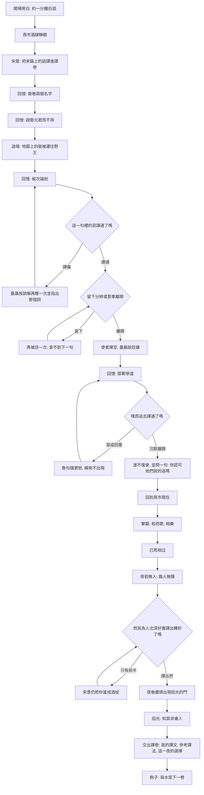

# 《入史・燕市》遊戲設計

給中學約 14–15 歲、中文與背景知識都不差的學生。學習材料只限《史記・刺客列傳》荊軻開頭這一段：從身世、榆次、邯鄲，到燕市高歌又相對而泣，停在田光「知其非庸人也」。易水、地圖、匕首不放進這一卷。

這份文件做三件事：把故事流程定下來，說明學生怎樣走到荊軻的感情裡，並比較三個做法。平台日後擴成「用自己的話走進《史記》」，本篇是第一卷。

---

## 1. 名字

平台叫 **《入史》**。

學生進入列傳裡的那一天，也把譯文交回這一卷裡。副題可以用：「用你的話，走進《史記》。」

本篇全名：**《入史・燕市》**。封面小字：「刺客列傳・荊軻」。

另外兩個可用的名字，留到第 7 節比較。不建議用「荊軻」「刺秦」「易水」當平台名。那些名字把整座平台釘死在一篇、也釘死在後來的行刺，和這一段「還沒有人真正認識他」的感情不合。

---

## 2. 開場：約一分鐘的白話

影片可以以後再做。第一版用四張靜圖加旁白就夠：衛國巷口、榆次一瞪、邯鄲棋局、燕市夜酒。旁白依《刺客列傳》荊軻本傳改寫，不另編情節。

> 戰國末年，秦國一步步向東。司馬遷寫《刺客列傳》，在專諸、聶政之後隔了二百二十多年，才寫到荊軻。
>
> 荊軻是衛國人，祖先是齊人，遷到衛以後，衛人叫他慶卿。他離開衛、到了燕，燕人就改叫他荊卿。他好讀書，也好擊劍，拿這套本領去遊說衛元君，衛元君不用他。後來秦攻魏，設置東郡，把衛元君的旁支親屬遷到野王。他出來的那個衛，已經不是回得去的地方。
>
> 他到過榆次，與蓋聶論劍。蓋聶生了氣，瞪着他。荊軻走了。有人要再把他叫回來，蓋聶說：剛才論劍，他有不中我意的地方，我瞪了他；你去看，他該走了，不敢留。使者趕到住處，荊軻已經駕車離了榆次。蓋聶說：本來就會走。是我剛才用眼光震住了他。
>
> 他在邯鄲與魯句踐博戲，爭奪棋路。魯句踐大聲斥責。荊軻不做聲，走了，從此不再見面。
>
> 到了燕，他與兩個人要好：酒桌上的宋意，和會擊築的高漸離。他極愛酒。三人天天在燕市喝。喝到有些醉，高漸離擊築，荊軻在街市上應和着唱。他們一起快樂，不多久又相對哭泣，旁邊好像沒有別人。
>
> 司馬遷說，他雖然混在酒徒裡，人卻深沉，喜歡讀書；走到哪一國，都與賢能、豪傑、年長有德的人結交。燕國的處士田光對他很好，知道他不是普通人。
>
> 這一卷走到這裡為止。後來的太子丹、易水、秦廷，先不要。今天要走的，是他還會離開、也會在市上又笑又哭的那段路。

說完，學生在燕市酒肆睜眼。身分是荊軻，嘴上卻只會說自己的白話。耳邊的人講的是原文。

---

## 3. 這一段裡，他的感情怎麼走

《刺客列傳》這一段幾乎沒有荊軻的臺詞。感情都在別人怎麼看他，以及他怎麼動。

| 次序 | 原文在做的事 | 感情 | 學生若只把它當翻譯題，會漏掉什麼 |
| --- | --- | --- | --- |
| 1 | 慶卿，到了燕又叫荊卿 | 名字隨地方換，沒有穩的歸處 | 「之」是「去」，不是語助詞。叫錯名字，就是還站在錯的城裡 |
| 2 | 以術說衛元君，不用 | 有本事，沒人用 | 「說」讀遊說，不是「聊天」 |
| 3 | 支屬被遷到野王 | 連那個不用他的國也沒了 | 這是退路消失，不必做成答題關 |
| 4 | 蓋聶怒而目之，他駕車走了 | 受辱。對方把「走」說成「怕」 | 「目」是瞪，是震，不是看一眼。他選擇不留 |
| 5 | 魯句踐叱之，嘿而逃去 | 再一次當眾被辱。他仍不還口 | 通關動作是沉默離開，不是妙語反擊 |
| 6 | 燕市歌、樂、已而相泣 | 樂和悲在同一首歌裡 | 要先讓學生經歷前兩次「被看輕」，這一哭才有重量 |
| 7 | 旁若無人 | 人很多，卻像沒有人 | 譯通之後，路人還在，點下去沒有回應 |
| 8 | 雖游於酒人，然沈深好書 | 外表是酒徒，裡面不是 | 這一句是在替自己辯白，卻出自太史公，不是荊軻自述 |
| 9 | 田光知其非庸人 | 第一次被看見 | 終點是被認出，不是行刺 |

兩次「離開」是這一段的脊骨。榆次是被人瞪走，邯鄲是自己沉默地走。學生很容易譯成「荊軻膽小」。遊戲要讓他們先感到那一瞪、那一聲叱，再自己決定走；走通之後，才聽見蓋聶說「是我嚇走他的」。學生會知道：史書裡留着兩種說法，一種是別人的，一種是他的動作。

燕市是高潮，不要做成第一關，也不要只做成最後一個翻譯框。笑和哭必須接在同一場面裡：「相樂也，已而相泣」。中間只隔「已而」。

---

## 4. 學生怎樣站在他的位置上

參考的兩款遊戲，結構可以借，題材不要借。

《Overboard!》是同一天裡用對話試探別人相信什麼；你知道的事會留下，人對你的看法會改。《完美的一天》是一個學生回到某一天，用地圖和時段去理解別人的心情；選錯多半不會把遊戲卡死，只是這一天因此不同。

兩款都不是「答對才准看下一頁」。玩家始終有一件故事裡的事要做。

本篇也給學生一件事，而不是一張工作紙：

**宋意說：你從衛國走到這張酒桌，那些人的話你自己都對不上。把他們的話譯給我聽。譯通了，歌才唱得下去。**

學生是荊軻，可是不演一個會解釋內心的荊軻。那不像這篇原文。學生做的是：

1. 聽對方說出需要學的原文。
2. 用自己的白話寫出意思。
3. 譯偏了，對方就按那個錯誤意思反應，學生因而知道哪一個詞沒有落地。
4. 譯通了，得到的不是「下一題」，而是一個線索：某人相信你怕了、某人不再見你、某一句歌其實在哭。
5. 少數地方可以選擇留下或離開。歷史上的那一條路是離開。留下可以走一小段，然後仍會被瞪、被叱，再匯回原文。選擇不改史實，只讓學生感到「留下並不輕鬆」。

這樣，翻譯就是聽懂。聽懂了，才摸得到他為什麼不爭、為什麼唱着唱着會哭。

---

## 5. 場景：哪些值得做，哪些只做過場

整段拆成 **一個現在，四段回憶，一個終場**。現在永遠是燕市。宋意坐在桌邊，當這一夜的聽眾。回憶裡他不走進衛國或邯鄲，只在畫面側邊插話。這樣助手從第一場就在，又不會穿幫。

### 值得做成場景

**場景 0・燕市酒肆（框架，現在）**  
夜色、酒、宋意、高漸離和他的築。築先不要響。宋意把空白竹簡推過來：「譯卷」。  
學生要感到：這一夜還沒有唱，前面的事卻已經積着。

**場景 1・衛巷：兩個名字**  
路人叫「慶卿」。另一個從燕地來的人改口叫「荊卿」。  
必譯：「而之燕，燕人謂之荊卿。」  
要抓住的詞：`之` 是去，`謂` 是稱。  
譯成「的」或「他」，路人會把你送回衛巷，燕市的門不開。  
感情：你是誰，要看你站在哪一座城。

**場景 2・衛元君面前：說而不用**  
短。殿不需要大。君王聽完，只丟兩個字。  
必譯：「以術說衛元君，衛元君不用。」  
要抓住的詞：`說` 是遊說，`不用` 是不任用，不是「沒有使用這把劍」。  
譯通之後沒有獎。君王已經轉身。學生要感到譯對了也不被留下。這就是「不用」。

**場景 3・榆次論劍：那一瞪**  
全篇最值得做的對峙。蓋聶與荊軻論劍，話不投機，蓋聶怒而目之。畫面就把「目」做出來：四周先靜，再只剩那雙眼睛。  
第一句必譯：「曩者吾與論劍有不稱者，吾目之。」  
`不稱` 不要只教成「不同意」。是不中他的意、他看不上。`目之` 是瞪，並且要讓人感到被壓住。  
學生譯通後才出現選擇：留下分辨，或登車走。  
- 走：使者再到時，屋已空。蓋聶的第二句打開：「固去也，吾曩者目攝之！」`目攝` 是用目光震懾。學生這時會聽見，自己的離開被說成了膽怯。  
- 留：蓋聶再瞪一次，宋意在側邊說：「你可以留。史書上這一天你沒有留。」留不能拿到「目攝」那句。要聽到那句，仍得上車。  
感情：被看輕，以及你走了以後，看輕你的人會如何向別人講這件事。

**場景 4・邯鄲博局：嘿而逃**  
先下一手極短的博戲，兩人的棋路撞在一起，學生先碰到「爭道」，再讀原文。不必做成真正的六博規則課，只要感到「這一格我們都要」。  
然後魯句踐怒而叱之。  
必譯：「荊軻嘿而逃去，遂不復會。」  
`叱` 是當眾斥責，`嘿` 同「默」。  
這裡的通關不是寫一句漂亮的回罵。學生若在譯文裡讓荊軻反擊，魯句踐會更大聲，街坊跟着笑，線索不出現。學生改寫成「他不做聲，離開，從此不再見」，巷口才落下「遂不復會」。  
離開時遊戲問一句，不計分：「他們說你逃。你認可嗎？」三個答案都收進譯卷：認可、不認可、還說不清。這是感情，不是考題。  
感情：忍。第二次離開比第一次更安靜。

**場景 5・回到燕市：樂，然後泣**  
回憶做完，築才響。同一畫面分兩拍，不要切場景。  
第一拍必譯：「高漸離擊築，荊軻和而歌於市中，相樂也。」`和` 讀應和。  
第二拍必譯：「已而相泣，旁若無人者。」`已而` 是不久，中間不能插一段長篇解釋。畫面由暖轉冷，歌還是那一支。  
`旁若無人` 譯通之後，學生點路人，路人嘴巴在動，沒有聲音。宋意和高漸離還在。  
感情：快樂和悲傷是鄰座。人多，卻像沒有人。

**場景 6・酒肆外的夜巷：沈深**  
不換城。宋意說：「市上的人都說，你不過是個酒徒。」  
必譯：「荊軻雖游於酒人乎，然其為人沈深好書。」  
`雖……乎，然……` 是轉折。譯不出「然」，宋意會只記住前半句，仍把你當成酒徒，田光的門不開。  
感情：被誤認。要自己把後半句譯出來，門才出現。

**場景 7・田光門：非庸人**  
處士，門很素。他已經讀過學生這一夜写下的譯卷，用其中一句叫學生，而不是叫「懦夫」或「酒徒」。  
必譯：「知其非庸人也。」  
`庸人` 是平常人、普通人。田光不講大道理。他只是待你，並且讓你知道自己被看見。  
卷末一句話，當鉤子，不開新關：「易水以後的風，是下一卷。」

### 只做過場，不做關卡

- 「其後二百二十餘年秦有荊軻之事」：放在旁白，用來定位。
- 「其先乃齊人，徙於衛」：寫在人物小卡，點開可看。
- 「秦伐魏，置東郡，徙衛元君之支屬於野王」：場景 2 結束後的地圖。衛的標記被挪到野王，再點不回去。一句原文浮在地圖上，學生可以譯，譯錯不卡關。
- 「其所游諸侯，盡與其賢豪長者相結」：結算時用三張名帖帶過，不必再找三個路人。

### 原文裡值得做進畫面、但不必出題的細節

- 築：竹製、用竹尺擊弦。給一張特寫，避免學生把它想成琴或鼓。
- 宋意：酒桌上的同伴，不是文士。他的白話要像市井人。
- 「已駕而去」：榆次要看得到車。離開是一個動作，不是選單裡的抽象按鈕。
- 博局上的「道」：棋路相撞的那一格。
- 酒酣：臉與燈都暖，但人還站得住。不是爛醉打鬧。這一段的哭，來自清醒的人。

### 本篇明確不做

行刺、樊於期、匕首、秦廷。那些場面更暴，也屬於另一段原文。這一卷的功課是翻譯和識人。把高潮做成刺殺，燕市的哭會被蓋掉。

---

## 6. 流程圖

一節課大約 25–35 分鐘。必譯只有六句，其餘是過場、選擇和不計分的一問。

六句是：

1. 而之燕，燕人謂之荊卿。
2. 以術說衛元君，衛元君不用。
3. 曩者吾與論劍有不稱者，吾目之。
4. 荊軻嘿而逃去，遂不復會。
5. 已而相泣，旁若無人者。
6. 知其非庸人也。

蓋聶的「目攝」、燕市的「和而歌」、夜巷的「雖……然……」放在同一場景裡當加譯。時間夠就寫，時間不夠仍可通到下一拍。不要做成十道閘門。

---

## 7. 三個版本

### 版本甲：史線直行

就是「走到一座城，點一個人，他說原文，譯對才進下一城」。助手在角落。開頭放旁白。直線，約六到八個翻譯點。

**可行。** 適合第一個能上課的版本。一節課講得完，老師也容易知道學生卡在哪一句。

限度也很清楚。它像披了圖的練習。學生是荊軻，卻沒有做過荊軻做的那種決定：走，或不說話。重玩一次只是再答一遍。《完美的一天》和 *Overboard!* 讓人想再走，是因為知道了以後，同一句話意思會變。直線閘門沒有這個。

### 版本乙：燕市一日

第 5、6 節的流程。現在時固定在酒肆，衛、榆次、邯鄲是這一夜被宋意問出來的來路。譯通拿到的是「別人相信什麼」，不是下一題的鑰匙。譯偏，角色按誤解反應。邯鄲必須沉默才走得出去。燕市先樂後泣。田光看的是譯卷。

若日後要加一點點重玩：同一夜可以再過一次，已經懂的詞會標在譯卷上，蓋聶的台詞可以少掉解釋、早一點出現「目攝」。不必做成八小時時間迴圈。那是 *Overboard!* 的骨架，搬全套會吞掉文言文本身。

**這是建議採用的故事。** 它保住版本甲的課堂長度，把「成為荊軻」放在少數幾個動作上：被改名、被不用、被瞪之後仍離開、被罵時不還口、同一首歌裡由樂轉泣、最後被一個人認出。

### 版本丙：列傳故事館

《入史》不是荊軻單機遊戲，是同一套閱讀結構的故事館。

每一卷都是：

1. 一分鐘白話，只講這一夜需要的背景。
2. 學生進入那個人的位置，但只在原文真正留下空隙的地方做選擇。
3. 關鍵的人說出要學的原文。
4. 學生用白話譯；譯偏則被誤解，譯通則改變別人對你的看法。
5. 一個屬於這一夜的助手，只解字、講場面，不代寫整句。
6. 結尾交出譯卷，並用一句話指向下一卷。

資料從第一天就按「平台 → 卷 → 場景 → 原文句 → 關鍵義項」來存。荊軻是第一卷，不是特例。下一卷若做易水，仍沿用譯卷、誤解回饋和助手，只換場景與感情。再往後可以是〈鴻門〉〈負荊〉〈漁父〉，每一卷獨立可玩，教室一次只開一卷。

版本丙先不要做大廳動畫和很多篇。先做版本乙，儲存格式用版本丙。

### 對照

| | 版本甲 史線直行 | 版本乙 燕市一日 | 版本丙 列傳故事館 |
| --- | --- | --- | --- |
| 和原先構想的關係 | 幾乎就是原先構想 | 保留翻譯閘門，改了敘事框 | 把乙做成可加篇的平台 |
| 一節課能否做完 | 能 | 能 | 每一卷能，平台慢慢加 |
| 感情從哪來 | 靠畫面順序 | 靠兩次離開、由樂轉泣、被認出 | 每一卷自己的那一個動作 |
| 重玩 | 再答一次 | 同一夜，已知的詞會提前生效 | 換一卷就是新的一天 |
| 最大風險 | 變成作業 | 場景稍多，要克制閘門數量 | 一開始做太寬，第一卷遲遲上不了 |

### 比「整段都做成自由對話」更好的地方

自由對話很像兩款參考遊戲，不適合當這一課的主體。14–15 歲學生的譯文若沒有抓手，空話也能混過去；若每句都卡死，感情又會被挫敗蓋住。

更好的尺度是：

- 一場只有一個必譯句，句中只抓兩個到四個義項。
- 義項到了就前進，字面不必與參考譯文相同。「燕國人改叫他荊卿」和「到了燕，那裡的人稱他荊卿」都算通。
- 缺一個義項時，不彈「標準答案」，由角色抓住那個詞再問。例如學生把「目之」寫成「看了他一眼」，蓋聶說：「看一眼？你再看我的眼睛。」
- 整句離題，宋意用白話重講場面，學生重寫。
- 結算並陳三樣：學生的譯文、一種參考譯法、這一夜的選擇。參考譯法是對照，不是分數的唯一形狀。
- 自動判斷第一版用人工寫好的義項和同義詞。日後若加模型點評，只能在義項已經判定之後，寫一句鼓勵或追問，不能改判。

材料裡有幾處括註宜教得更準，否則回饋會把學生帶偏：

- `不稱`：不中意、看不上，比「不同意」更貼蓋聶的傲。
- `目` / `目攝`：瞪視、以目光震懾，不是看一下。
- `築`：擊弦的築，不是泛稱的樂器。
- `和`：應和，讀 hè。
- `嘿`：沉默，同「默」，不是語氣詞。

---

## 8. 助手：宋意

助手是 **宋意**。《史記》寫荊軻在燕市的酒伴，沒有留下名字。《燕丹子》寫後來易水送別，高漸離擊築，宋意和歌。他是同一圈人裡負責應和的那位，用來做酒桌上的聽眾，比一個職稱溫和，也仍在荊軻的故事裡。

他不講課，也不先把提示遞過來。學生點他，自己問一個字或一個詞，他只回答那個字在這句裡的意思。若學生要他把整句譯出來，他會拒絕。

翻譯是否通過，由後端看意思重合程度。大約八成即可，不要求和參考譯文用字相同。答錯時他只點出還沒落到的一個要點，不把整句白話寫出來。

他有他不會的事。問到「處士」「沈深」這類詞，他說：「這是田光先生那一路人的話，我只懂酒和街上的話。」然後仍只給字義，不代替田光把人看穿。

田光不當助手。他若負責提示，最後一句「非庸人」就廉價了。高漸離負責音樂，不負責解字。衛元君、蓋聶、魯句踐都是壓力，不是幫手。

畫面上，宋意在酒肆是完整的人；在回憶場景裡只留側影和兩句耳語，提醒學生：這是後來在酒桌邊想起的事。

平台擴篇時，不必每一卷都是宋意。固定的是功能：一個故事內的普通人，只解字、講場面、不代譯。燕市這一卷，這個人就是宋意。

---

## 9. 平台以後怎麼長

《入史》的單位是「卷」，不是小遊戲。每一卷對應《史記》裡一個可以在一節課走完的場面。

建議的順序：

| 卷 | 學生進入的位置 | 感情上的那一個動作 | 為什麼排在這裡 |
| --- | --- | --- | --- |
| 燕市 | 荊軻 | 離開，並且不解釋 | 第一卷。原文短，暴力低，翻譯點清楚 |
| 易水 | 仍是荊軻 | 唱完就走，不再回頭 | 用同一個人接上本卷的鉤子。秦廷一擊用留白，不做成動作場面 |
| 鴻門 | 張良，或座中的劉邦 | 在別人的怒氣裡把一句話譯對，人才能離席 | 學習「對話裡的力」 |
| 負荊 | 藺相如 | 避，而不是爭路 | 和邯鄲「爭道」遙遙相對，都是忍 |
| 漁父 | 屈原 | 回答漁父，但不必被說服 | 適合已經會譯轉折句的班級 |

大廳只要一份卷目：篇名、出自哪一列傳、這一夜要譯的六句、是否已交出譯卷。不要先做大地圖。

和桃花源其他閱讀工具分開。悅讀負責找文章、摘要、出題；《入史》負責把一篇列傳走成一天。兩者以後可以互鏈，不要合成同一個頁面。

---

## 10. 建議就這樣定

做 **版本乙的故事**，用 **版本甲的篇幅**，按 **版本丙的格式** 存資料。

第一版可以沒有影片、沒有模型批改、沒有時間迴圈。要有的是：旁白、七個畫面、六句必譯、譯偏時角色會接話、宋意三次以內的求助、邯鄲那一次「不說話才能走」、燕市同一場面由樂轉泣、最後田光看譯卷。

學生離開時，手上不是分數，是六句他自己的話，以及一句沒有標準答案的話：他們說你逃了。你認不認可。
